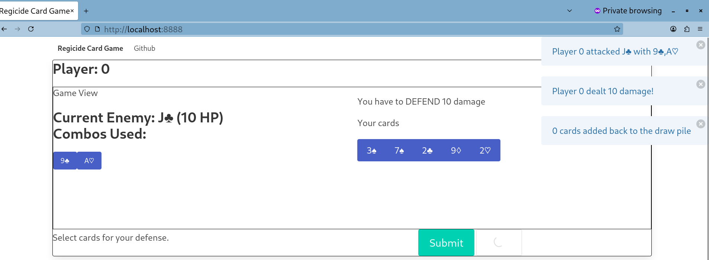

# `regi_py`

This repo contains a C++ implementation of the game mechanics of the card game
[`regicide`](https://badgersfrommars.com/en-us/pages/learn-to-play-regicide), 
with Python wrappers via `pybind11`.

## Installation

Install this package via Python's `pip` tool on the command line:

```sh
# activate anaconda/uv/whatever for Python env
git clone https://github.com/ahgamut/regi-py
cd regi-py
python3 -m pip install -e .
```


## Viewing a basic simulation

Run the `driver.py` to see a basic command-line simulation of the game, where
each player randomly selects a valid move to play.

```sh
# install the package first
python driver.py
```

To use custom strategies available in the package, specify them with
`--add-bot`:

```sh
python driver.py --help # view options for bots
python driver.py --add-bot damage --add-bot preserve
```

## Playing with a bot

Run `webdriver/driver.py` to play a 2-player game with a bot that picks random
moves

```sh
# install the package first
cd webdriver
python driver.py \
    -n 1 \ # one human player needs to connect
    --add-bot damage # add the 'damage' bot
# go to http://localhost:8888 in your browser
```



## Adding your own strategies

Subclass the `BaseStrategy` class with your own implementations that select what
attack/defense moves to make.
